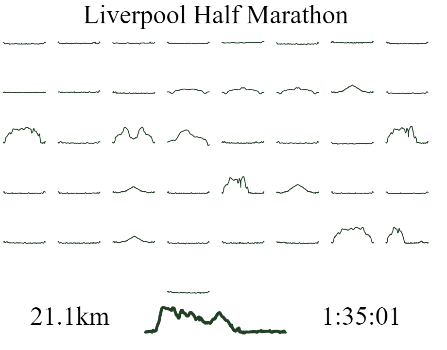
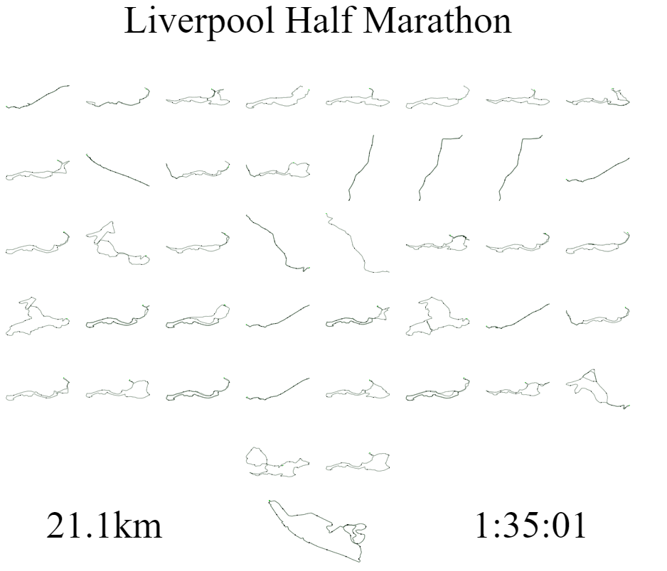

# Playing with SVGs
Here I am creating some tools to help with manipulating SVGs and then implementing them for some more *artistic* representations of strava data (using the plots generated in [Strava to SVG](https://github.com/dajhutchinson/Strava_To_SVG)).

## Grid Image
| Elevation | Routes |
|-----------|--------|
|  |  |
